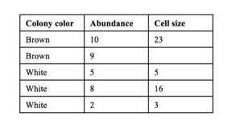
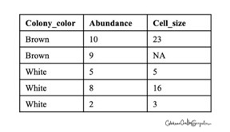

# Tutorial 3: Importing files into R

Based on a document created by: Jason Pienaar and Tom Miller and modified by CCG
Edited by: CCG 2021

## Outline

### Learning objectives:
* Load data in R from external tools
* Practice plotting and data manipulation

What you should have at the end of this tutorial
* A word document with answers to Tasks.
* A script document with the code you produced in this tutorial.
* A basic understanding of how to run basic R code and obtain results.

### Content:
1.	Importing files
2.	Recreating data from Griffin 1972 in excel – importing this dataset into R
3.	Create new plot

## Importing Files
Three Steps for Reading Files or Data Into R:
 
### 1. Changing the Working Directory:
First, we need to tell R which directory we are using. This is equivalent to answering the question: where are your files in the computer? When using R, it is much easier to have all the files you are going to use organized in one folder or directory.
 
Here, I will provide guidelines to save your progress in your google drive and access a working folder in the school computer via ‘vlab’. I will insist we all do this for now to have the same set up for the purpose of the class. However, if working on your own computer, you can save your progress in the same folder you direct R to (see In your computer section below).
 
#### Google drive
Make a folder called ‘Rtutorials_MicrobEcol2020_drive’. Use it to save and store files with your progress in R tutorials.
 
#### In vlab
Once you have logged in, navigate to ‘Documents’ and create a folder specifically for your R tutorial and associated files called ‘Rtutorials_MicrobEcol2020’. You may need to do this every time you log into vlab, so make sure you any progress you make back into your google drive folders.
 
Once you have a folder, tell R where it is. Open Rstudio, navigate to the menu at the top of the screen and click on Session (should be in the center). Select Set writing directory and then Choose Directory… in order to find the your folder. Navigate to Documents and select your newly created folder  ‘Rtutorials_MicrobEcol2020’.
 
#### (optional) In your computer
Create a folder, provide a clear name and save it in a place you know well. Save all files related to these R exercises within this folder. Use the above instructions to set the writing directory within Rstudio.
 
#### (advanced) Use the command to set the writing directory
setwd() function in R determines the writing directory (see help(setwd)))
getwd() function in R tells you where the writing directory is located
 
### 2. Preparing the data file in Excel (or other program)
We are going to focus on 4 simple ways to get files or data into R. But, before we do this, we are going to create a very simple data set in Excel to use for the rest of the exercise. R supports rectangular data sets (matrices) in the form of “data frames” where the rows represent observations or measurements and the columns represent variables. The data frame is the object that we will use most often to read in and store data to be analyzed.
 
### Task 1. Open Excel and create a file with 3 columns labeled “colony color”, “abundance”, and “cell size”. For color enter: brown, brown, white, white, white. For abundance, enter: 10, 9, 5, 8, 2. For size, enter: 23, (leave this cell empty), 5, 16, 3. Save this table in your folder as ‘Table1R’.


Now, we want to get this data into R. But, I will not work (and I will prove this to you later).
 
We intentionally started with a file that R cannot read. It has a couple of common problems that need to be fixed before any file can be brought into R.
* Variable names (the column names) must follow the R rules.
* Missing values must be converted to a form that R recognizes.
Remember the rules for naming variables given in Tutorial 1: variable names are composed of letters, numerals, and periods (.) and spaces are not allowed. Missing values are frequently a source of problems for different analysis and graphing programs. The simplest way to ensure that R recognizes missing values is to convert them to “NA”. Let’s fix our data table.
 
### Task 2. To fix the table, change the variable names from “colony color” to “colony.color” and from “cell size” to “cell.size”. Save the new table as ‘Table1R.fixed’. It should look something like:
 
 
 ### 3. Reading the Data into R:
There are a few ways to enter this data into R. Here we will explore importing data stored in excel files. In R, each data set will be referred to as a “data frame” and be given a name – in our example, we will create the data frame called * * bacteria * *.
* The simplest type of file to read into R is a plain text file created in notepad. However, most of us don’t use simple text files, but instead use something like Excel for entry and database management. Standard Excel files (“.xls”) have lots of extra hidden coding that is necessary for Excel, but makes it difficult for other programs to read these files. We could cut and paste the Excel file data into a text editor, but this would be involving a 3rd program as a translator between two others, which is getting a tad ridiculous. So, let’s consider some more practical steps.
* Most programs can write the output as text files. Then, the text files can be read straight into R. R simply requires that there be “white space” between the variables in each row of the data: this may be tabs or actual spaces. So, simply use “Save As . . .” to save the data file from Excel as “Text (tab delimited)” and name it “Table1R.txt”. To be able to compare good tables to poorly formatted tables, do this again for your corrected table and name it “Table1R.fixed.txt“. Then, the file can be read into R using the following commands (we will call the data frame “bacteria”):

```
bacteria = read.table(“TableR1.txt”, header=T)
```

You will probably get an error here. Remember we talked about how that table was wrongly formatted? Lets take a moment to talk about **error messages**.

### Task 3. Reflecting on the errors that R gives you is one of the most important skills you will develop as a coder. Soon, you will be able to interpret these easily (or many of them) and fix your mistakes. To complete this task, answer the following questions regarding this error:
a.     What does this error say?
b.     What do you think it means? What does it mean by ‘line 2’? by ‘elements’?
c.     How to fix it? (hint: you already fixed it – see your TableR1_fixed – explain why this fixes it.
d.     What does it normally mean to you when someone says you made an error? How does it compare to these error messages? How can we make progress unless we try things and learn from our mistakes? (answer in 5 sentences or less).
 
Now that you have interpreted and reflected on the error message, let’s continue with the correct table. Make sure to save it as a tab delimited file.

```
bacteria = read.table(“TableR1.fixed.txt”, header=T)
```
This command finds the file and recognizes that there are labels (“headers”) for each variable. The “T” stands for TRUE and must be capitalized. The second command (“bacteria”) simply causes the file to be printed. The data file will now be available for use in R.

You should no be able to take a look at your data frame in R, by just typing the name of the object

```
bacteria
```

You can also inquire as to what type of object it is

```
class(bacteria)
```
You can also explore the contents of your data frame by looking at specific cells, columns or rows. This is a critical skill when you are working with large datasets.

```
bacteria[1,1]
bacteria$Abundance
bacteria[1,]
bacteria[,1]
```

### Task4
In your own words describe how to use the brackets and the $ sign to find:
•	The data point for the cell size of the second brown colony 
•	All the information from the second white colony (Abundance and cell size)
•	All the cell size data in a vector
•	The average of all cell sizes
•	The sum of all Abundances
 
### Importing files Summary 
Often, the most frustrating part of using any program is trying to figure out how to get your data files into the program so that you can start analyzing it. The point of the above was to provide a simple demonstration of how to do this in R. There are many other ways to do this, like reading in data directly from Excel or some other statistics program, but the procedures above works every time and is by far the simplest. Here is a quick summary of how to get your data into R and make the variables available for further analyses:
a)     Get your data into excel, making sure that it is in correct R format for dealing with variable names and missing values. Save as a text file, comma (csv) or tab (txt) delimited.
b)    Open R and make sure you have the working directory set correctly. Use getwd() to check.
c)     Import your data:

```
myfile = read.table(“filename.txt”,header=T)
```

### Task 5 Griffin 1972 data
Create a new excel file within the same folder and record the data from Griffin 1972 Figure 1. In particular, we want a table with columns: ‘Pathogen’, ‘MaxTemp’ and ‘Species’. Pathogen will depict ‘Yes’ or ‘No’ character strings. Max temp will be numeric and you will log the temperature from Fig1 (data depicted by horizontal bars – scale on x axis on top). I suggest you include the dotted line, for example row I (N. fowleri – Virginia) would depict 46 oC. Species will record the amoeba species (Naegleria, Acanthamoeba or Hartmannela – leave Tetramitus as part of Hartmannella category).

Once you have this table ready, save as tab delimited file – obtain a file that ends on ‘.text’. I suggest you give it a short name with no spaces. Double check this file is in the folder with your script. 

Back on your script, use ‘read.table()’ function to import your Griffin data. In my computer, it looks like this:


```
read.table('Griffin 1972_testtable.txt', header=TRUE)
```
If everything worked out, you would see this output:
   Pathogenic MaxTemp      Species
1         Yes      46    Naegleria
2         Yes      46    Naegleria
3         Yes      45    Naegleria
…

Now, let’s assign an object name to our data.frame (because that is what it is, if you do not believe me, use class() to evaluate the object). 

```
Griffin.data=read.table('Griffin 1972_testtable.txt', header=TRUE)
class(Griffin.data)
```

### Task 6 A new plot
You have done such a good job at making this table, that all we have left to do is plot! Today, we will use a different kind of plot, a boxplot, to ask the fundamental question of this paper: is temperature tolerance related to virulence?

Notice that we can extract the different columns from the dataset by using the dollar sign ‘$’. Thus Griffin.data$MaxTemp is a vector with all the temperature data, try it out:

```
Griffin.data$MaxTemp

```
And Griffin.data$Pathogenic is a list with all the character strings depictin ‘yes’or ‘no’

```
Griffin.data$Pathogenic

```

Now all we have to do is use the boxplot() function on these two objects (a correlated vector and list):

```
boxplot(Griffin.data$MaxTemp ~ Griffin.data$Pathogenic)
```

Discuss whether this new figure supports the conclusions of the paper. 

 ### Task 7 A Pretty plot
Now let us improve on this figure a bit. Each time we do this, we will learn one more step in how to build publication grade figures. For example, the axis labels in our previous figure were just the names of the vector and list, and it doesn’t look super pretty – plus it is not very informative unless you built the table yourself. You can change the names of the axis labels easily by adding elements to the plot function:

```
boxplot(Griffin.data$MaxTemp ~ Griffin.data$Pathogenic, xlab='Strain pathogenicity', ylab='Maximum Temperature')
```

### Task8 (optional) What about the species?
We also recorded data for the amoeba species but have not looked into whether this plays a role. We can easily modify the figure to include these:
```
boxplot(Griffin.data$MaxTemp ~ Griffin.data$Pathogenic*Griffin.data$Species, xlab='Strain pathogenicity', ylab='Maximum Temperature', col=c('blue','red'))
```
Make sure your figure window is large enough to see the x axis labels. They should depict both the column of pathogenicity and species. 

What can you conclude about the behavior of the different species of amoebas regarding pathogenicity and temperature tolerance?

### Congratulations! You have completed this R tutorial!
