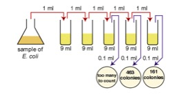

# R Tutorial 5: Creating functions 
Created by: CCG 2020
Edited by: CCG 2021

R has many built in functions and Packages seem like a never-ending resource for additional functionality, but what to do if you need something very specific to your data or your research applications? Abstracting your code into small functions is key to render your work reusable and transferrable to other members of your team and other users. Through this process, your code gains in power, convenience and elegance (R core team 2018). The ultimate output of writing generalizable functions would be to write your own Package and share it with the world. But let’s not get ahead of ourselves. In this tutorial, we will explore some examples and build some basic functions. Then, you will use some of these tools to construct your own original function. 

References and resources:  
•	[Functions page by Nice R code (2013)](https://nicercode.github.io/guides/functions/)  
•	[Writing your own functions](https://cran.r-project.org/doc/manuals/R-intro.html#Writing-your-own-R-intro.html%23Writing-your-own-functions) – Ch10 in: An Introduction to R (2018). R Core team.   
•	[Functions in Advanced R by Hadley Wickham](https://adv-r.hadley.nz/functions.html)  

## Part 1 – Introduction to Functions
### An example
Writing functions can be extremely simple. This function allows you to calculate the circumference of a circle from the user input of a circle’s diameter. 

A.	Define the function and load it in R:

```
circle_circ = function(diameter) { 2*pi*(diameter/2) } 
```
B.	Use the function

```
circle_circ(3)
```
You should obtain: 9.424778

### Generalized function building

Functions in R are defined by code that follows this format:

```
function.name = function(arg1, arg2, arg3=pi, …) { # function name and arguments
		newVariable=sum(arg1, arg2) # function body
		print(newVariable) # return value
}  # close your function
```

Format description:  
* Make sure function.name is unique and does not interfere with default R functions or the names Objects (tables, figures, lists) in your project.
* Arg1, arg2 (also called formals in R lingo): you can include any number of arguments and these can be numbers, strings, arrays, lists, data frames, matrices. Any information you want the user to be able to indicate to customize your function.  
* Some arguments can be set up to have a default value (like arg3 in my example above). The user only needs to provide a value if they want to change the default. Arguments without a default need to be provided by the user or your function will not work.  
* Function body: the code between the brackets will be run every time you type the function’s name (every time you call the function). Code can be very long or very short, but you should aim at making them as short and clear as possible. Larger code can usually be shaped of several shorter independent functions, and this makes it easier to debug (find problems).  
* Return value: This last line of the code represents the value that will be returned or printed once the function has run its course. It is not absolutely necessary for a function to give you output: some will make a plot or perform a transformation of a data frame for example. It is a good idea to have some print out that indicates the function worked.  

### Loading your function on R 
Loading your function can be as simple as running the code (as we did with our example above), but you may want to save your function for later use, and load if from a new script to be used on different types of data. Therefore, there are two ways to re-use your function:  
A.	Open your saved function script, copy, and paste on your new script. Run your function before you use it. This one is the most straightforward approach.  
B.	Use the source() command to load your function from a saved script. To do this, make sure you save your function within the R folder of the project where you will be using it (to make it easier for your computer to find it). Some additional info on projects here: https://nicercode.github.io/blog/2013-04-05-projects/. This approach is more advanced but you should make sure you can run it. You will want to use it once you devise specialized functions to work with your own data.  

### Designing a good function  
Now that we have covered the basics of creating and implementing a function, let’s talk about how to design it. Ideally your function will:  
* Be short  
* Performa a single operation  
* Has intuitive, easy application for the user (this includes easy names)  
* Runs quickly  
* Gives reliable results  
* Is easy to reuse and implement in new projects  
* Easy to share  

### Some advanced tips
A.	Functions limit the scope of variables. For example, in:  

```
circle_circ = function(diameter) { 
radius= diameter/2
2*pi*(radius) }
```

The variable radius (and diameter) only exist within the body of your circle_circ() function. It is unaffected by any other variable in your code, and does not affect any other values, even if using the same names. That means that when you read code, you do not have to go inside of a function and try to interpret what those variables are doing. This also means that you must aim at having self-contained functions, that do not depend on other pieces of code in your scrip.

B.	Using the ellipsis argument (…) can be a powerfull way to pass arguments from an internal function to your newly created function. For example:

``` 
make.blue.plot = function(x,y,…) {
	plot(x,y, col=’blue’, …) }

make.blue.plot(1:50. 1:50, xlab=’my blue x axis’, ylab=’my blue y axis’) 
``` 

Your new function will automatically pass the xlab and ylab arguments to the plot function, without the need of user specifications. This allows you to use all the capabilities of an internal function with the wrapper of your newly created function, in this case, with blue plots.   

C.	Good functions will prevent you from repeating yourself. If you find that there are chunks of code in your project that are very similar and keep coming up, these are great candidates to create a function that replaces them. This will make your project shorter and clearer.  

D.	You can make anonymous functions with no name. These are useful for one line functions, that are used once within a larger expression. See Hadley Wickham Advanced R from the references for more details.  

## Part 2 – Making a function to facilitate calculations for serial dilutions in microbiology  

There are different calculations that need to be made to use serial dilutions in microbiology (Figure 1). Complete the following tasks in order to produce a working function that can help you with lab calculations.  

  
Figure 1. Serial dilution of an E. coli sample. Test tubes were used to obtain culture dilutions at 10-1, 10-2, 10-3, 10-4, and 10-5. Solutions from tubes 10-3, 10-4, and 10-5 were plated using 0.1mL and a spread technique. Resulting CFU are indicated for each plate. 

### Task 1. Define what your function will do. Although a good broader goal is to have a series of functions that accomplish all of these calculations, it is a good idea to start small. Here are a couple of ideas to start with (but you can choose to go on a different direction):
* Calculate the dilution factor from the volume of solute and the volume of culture
* Calculate the original broth’s concentration based on the CFU found in plates and their dilution factor
* Calculate the final concentration based on the original concentration and the dilution factor
* Calculate the number of steps you need in a serial dilution
* Calculate which tubes to plate starting with the original broth’s concentration
To complete this task, you just have to define your goal. Easy!

Example: I’m going to set a simple goal for myself. I will make a function that calculates the dilution factor based on the volume of culture and the volume of solute. That’s my goal! You can follow along with my goal, or, and I highly encourage you to, make your own (be brave! You can do this!).

### Task 2. Forget about functions for now, write the code you would use to accomplish your goal from Task 1. The code should perform the necessary calculations while making well defined variables with intuitive names. A good practice is to comment your code thoroughly, use # to explain what each line does (or almost each line, just annotate a lot). Test your code with known calculations to make sure it works. Debug until it does.

Example: Code to calculate dilutions factor:
```
Dilution_factor=Vol_solute/(V_solute + V_culture)
```

Test my code: I add 1mL of culture to 9 mL of sterile 0.9% saline, the dilution factor should be equal to 1/10 (same as 0.1 or 10-1). 

``` 
Dilution_factor=1/(1+9)
``` 

Is the output what I expected?

### Task 3. Look at your code: what are the arguments the user should input? Give them a name (a good, intuitive name), and replace them throughout your code. 

Example: The arguments I will use in my function are Vol_solute and Vol_culture. These are already clear throughout my code so I am set! The more abstract you start with, the easier it will be to finish this task.

``` 
Dilution_factor=Vol_solute/(Vol_solute + Vol_culture)
```

### Task 4. Now lets turn it into a function. Define your function, give it a name, some arguments and clean the body and test it!

Example:

```   
Dilution.factor.calculator = function(Vol_solute,Vol_culture) {
			Dilution_factor=Vol_solute/(Vol_solute + Vol_culture) 
			print(Dilution_factor)
			}
```

Test my function:

``` 
Dilution.factor.calculator(1,9)
```

Is the output what I expected?

Whether you followed along my dilution factor calculator, or (even better) if you completed your own original function:
# YOU DID IT!
You have built your own function, or computer program if you will. Congratulations!
