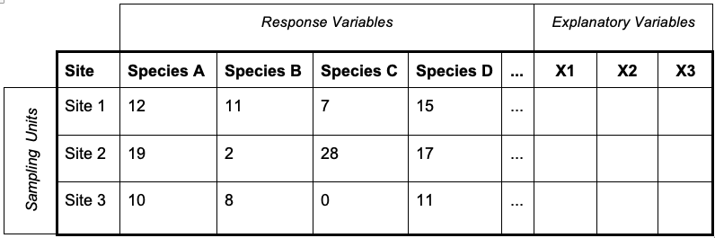

# Tutorial 6: Multivariate analyses of microbial communities
Based on a document created by: Thomas E. Miller
Edited by: Olivia Evans 2020, CCG 2020

In previous tutorials, you’ve gone through analyses of data with one response variable and one or more explanatory variables. Running things like t-tests, regressions, and an analysis of variance (ANOVA) can provide information on these data sets. However, multivariate data sets, where you have more than one response variable, cannot be analyzed with the same methods. This tutorial will introduce you to the format of multivariate data, what type of information we can get from it, and introduce you to some methods of multivariate analyses including ordination, cluster analysis, and discriminant analysis. 

## Introduction to Multivariate data 
Multivariate data sets are extremely common in microbial ecology. For example, field surveys may collect explanatory variables such as site location, temperature, and general conditions with the response variable being the number of individuals present for multiple species. Fishery biologists may be interested in what species come up in trolls at different locations during different seasons. Botanists often conduct plant surveys to understand forest classifications. In microbial ecology, data may be collected on which bacterial species are present in different host individuals. The key idea with multivariate data is that you have multiple response variables (aka y-variables such as the presence/absence or abundance of multiple species) and you’re interested in the differences and similarities between units/communities/sites such that you do not want to break these units up. 

The goal of any multivariate analysis is first to look at the similarities and differences between sites and then, depending on the analyses, potentially include the explanatory variables if those were collected. A multivariate data set often begins in a matrix with sites/communities/hosts as the rows, and both response and explanatory variables as the columns, as shown below in table 1. For the purpose of this tutorial, remember that words like site, community, unit, host individual, etc. refer to the rows in this matrix. These are what we are comparing and interested in! 

Table 1. Example sample-site table.  

			
There are a few steps in multivariate analysis and these are summarized in the image below (Figure 1). At this point, we’ve briefly gone over step one: the sample-species table. We will further explore how to manipulate your data to obtain tables in the correct format. In the interest of time, will jump over step 2, but you are encouraged to look at the additional materials in part 3 of this tutorial to learn about distance matrices. We will instead focus on step 3 and learn how to calculate and plot an ordination, how to evaluate the statistical significance of a multivariate dataset, and how to interpret the outputs of your multivariate analysis. If you want to learn more about clustering and discriminant analysis, we encourage you to explore the resources in Part 3 of this tutorial. 
Figure 1. Three steps in multivariate analysis. First: Species-site table and data formatting. Second: Distance matrix, where we calculate the compositional similarity between each pair of sites. Third: Visualization approaches and stats, include cluster analyses and ordination techniques. Four: How to interpret your results. Here we will focus on part 1, the ordination in part 3 and interpretation in part 4. 

## Part 1. Warm up: Data tables and univariate diversity measures for microbial communities
Begin by downloading and engaging the vegan package into your R space. This package has many functions for community ecology which we’ll be using throughout this walkthrough. For more information, check out the package manual here. 

```
install.packages(“vegan”)
library(vegan)
``` 

Then, create a dataframe for the hypothetical study we are working on. Imagine you went out in your boat to sample the water column of the Southern Humboldt Bay. You extracted DNA from your water samples and sequenced the V4 region of the rRNA gene to profile the bacterial community. Let’s say that we found four observational taxonomic units (OTU) and three different depths. In the following code, the first line gives the abundances of each OTU while the second and third lines name the columns and rows respectively. 

```
data=data.frame(c(12,19,10), c(11,2,8), c(7,28,2), c(15,17,11))
names(data)=c('otu1', 'otu2', 'otu3', ‘out4’)
rownames(data)=c('depth1', 'depth2', 'depth3')
data
```

Before diving into multivariate analysis, let’s briefly return to univariate measures. In order to learn more about each site used in this hypothetical study we are first going to look at the diversity of each site. Diversity is a univariate measure as it treats the species as an explanatory variable and is a composite of the evenness and richness of species at a given site. For this we’ll use the Shannon diversity index. Below, the first row assigns S as the number of species at each depth. H becomes the diversity (shannon could be replaced with either “simpson” or “invsimpson” depending on which index you want to use) while J is the evenness. 

```
S= specnumber(data)
H= diversity(data, index='shannon')	   
J= H/log(S) 
data2=data.frame(depth=rownames(data), S, H, J)
```

We can visualize these better by plotting the above measures. The first set of code creates a into a barplot. The second set is the same plot but uses the ggplot2 package – consider giving it a try! This package has a lot of flexibility for plotting (publication quality graphing). 

```
# Plots
barplot(S, main='Richness')

# or try in ggplot if you have it installed
install.packages(‘ggplot2’)
library(ggplot2)
ggplot(data2, aes(x=depth, y= S, main = "Richness"))+
         geom_bar(stat="identity")+
         ggtitle("Richness")+
         geom_text(aes(label=S), vjust=1.6, color="black",
                  position = position_dodge(0.9), size=3.5)
```

#### Task 1. Use this code to create the plots for evenness and diversity.

#### Task 2. Compare the richness, Shannon index and evenness of microbial communities at each depth. Which depth has the highest values? Why do you think that is? (think of the biology of this microbial habitat).

## Part 2: Coding Multivariate Analyses
Begin by ensuring that the vegan, and MASS packages are installed and activated in your library. You should also consider ggplot2, ggfortify, and gridExtra to make your plotting more advanced. In the following pages we will conduct a PCA as an example of an ordination, as well as perMANOVAs to assess significance of our analyses. While there are many more analyses, including hierarchical clustering and variance partitioning, this should get you started. Importantly, you will be using this code to analyze your lab data – so make sure you understand it!

### 2.1 Principal Component Analysis: Bacteria Community Example
Starting with a PCA we’ll be using two csv files for this analysis; the Nbact.csv file and the Nbact_metadata.csv file. Checking out the metadata file you can begin to explore this data set, which pertains to bacteria in different nitrogen related guilds. The metadata file contains explanatory variables for each sample such as the day of collection and distance to shore. Looking at the raw data you can see that this is organized differently then was explained in the introduction section of this tutorial. The columns in this file represent the 38 samples while the rows each represent a different ASV. This will come into play later, as we will correct for this. 

Begin by clearing your R workspace and bringing in the two csv’s. If you are having issues loading the files in, make sure you’ve defined the correct working directory. 

```
rm(list=ls())
Nspecies=read.csv('Nbact.csv', header=TRUE)
metadata=read.csv('Nbact_metadata.csv',header=TRUE)
```

Next, we want to correct for the fact that our species names are not numeric and that our samples are currently columns. The following script first checks that the column in question is not numeric, then removes the column. Finally, we transpose the entire data set, flipping the rows and columns so that it is formatted as described in the introduction, and add the guild names back in, as we are more interested in the guild then specific OTU assignment. 

```
is.numeric(Nspecies[,c(1:2)]) 
Nspecies2=Nspecies[,-c(1:2)] 
Nspecies3 = t(Nspecies2) 
colnames(Nspecies3)=Nspecies[,1] 
```

A side effect of transposing our data set is that it underwent a class change - transforming from a data.frame classification to a matrix. Checking the class of an R object if you’re having issues can be helpful - some functions switch the class we out declaring it while other functions only work with a certain format. Checking the class is easy, and done in the following code; 

```
class(Nspecies2)
class(Nspecies3)
```

From here, our data should be properly prepared. Pulling it up with the head() function and checking out the first few rows, we can see how the rows now represent each site and the column species, labeled with their guild assignment. We can now move forward with the analysis. 

With the Nbact data, let's run a principal component analysis (PCA). The code for this is fairly simple and the model is created with a single command in the vegan function - prcomp(). After this, all the other code is ways to present the information. 

```
NbactPCA<-prcomp(Nspecies3)
summary(NbactPCA) 
```

Using the summary() function on the Nbact PCA shows a table of all 38 principal components - showing the amount of variation on each axis. Recall that a ‘scree’ plot can be used to assess how much more variation is explained by each subsequent axis. We can create one easily in R using the NbactPCA model.

```
plot(NbactPCA, type="lines") 
```

#### Task 3: Which axis explains the most variation? From this - how many principal components would you recommend using?

PCA plots often take the form of a biplot. A biplot combines the community ordination with additional data - such as species vectors. A basic biplot can be created using the vegan package, as shown below.  

```
biplot(NbactPCA, xlab="PC1", ylab="PC2", expand=2)
```

We now have our final PCA ordination. It shows the spread of our samples (indicated as the letter name of each sample), and how each guild influences this structure (red arrows). It seems like a few samples clustering to the right have more species than the majority of the species clustering towards the middle. 
But remember, a PCA is not a statistical test. To test for significance we can run a PERMANOVA quite simply, using the adonis() function. PERMANOVA is the multivariate extension of the univariate ANOVA.

```
PCAscores=data.frame(scores(NbactPCA))
adonis(PCAscores~metadata$productivity, method='euclidean')
```

This PERMANOVA is asking if the ordination of samples significantly overlap in terms of productivity. Thus - is there a significant difference in the composition of communities of different productivity levels? Similar to an ANOVA, the null assumption here is that there is no difference between groups (thus sites overlap in the ordination space) and the alternative hypothesis is that at least one group is significantly different. 

#### Task4: Was the PERMANOVA significant? What conclusions can we draw from it along with our PCA biplot?

(optional)
But this can be better! We can build on your ggplot skills and use ggfortify to create a much nicer biplot. The ggfortify package (package information) tells ggplot how to handle objects made with prcomp(). Using the autoplot() function, we create the basic ordination scatterplot. Make sure to load all the necessary packages or you will get errors.

```
autoplot(NbactPCA, data = Nspecies3) + theme_bw()
```

What is the ‘+ theme_bw()’ doing? I like it better this way.

From here, we can color code the points by particular sample types - in this case productivity of a sample. This will allow us to explore the influence of any parameter on community structure. 

autoplot(NbactPCA, data = metadata) + geom_point(aes(col=productivity)) + theme_bw()

We can also add the labels to the points coding them as their row names - pointing out which specific sample each point represents. We won’t include this in our final plot but it can be useful at times. 

autoplot(NbactPCA, data = metadata, label=TRUE, shape=FALSE) + geom_point(aes(col=productivity), size=2)+ theme_bw()

Finally, we can add the eigenvectors representing our guild abundance data using loadings. Loadings are the correlation coefficients between the variables (rows) and factors (columns) and show how correlated a variable is with the ordination. Here, we’re interested in how guild abundance varies across the ordination, and if there are any correlations. 

autoplot(NbactPCA, data = metadata, loadings=TRUE, loadings.colour=’red’, loadings.label=TRUE, loadings.label.size=3) + geom_point(aes(col=productivity)) + theme_bw()

# You have completed this tutorial!


## Part 3. Additional materials, tips and references: 
### 3.1 A Few Handy Definitions:  
Before moving forward, here are some handy definitions that come up with multivariate analyses. Some were explained above but others were not. 

* Unit/site/community/object: These all refer to what multivariate data is being collected on or within. This may refer to a site where abundances on multiple species are noted, or an individual that has multiple measures taken on it. Whatever form it takes, this unit contains data on multiple response variables and the researcher is interested in comparing the unit as a whole to other units.    
* Distance Value: A measure of the pairwise dissimilarity between units. Objects/units that are more similar will have a lower distance value, where more different units will have a larger distance value. There are many different distance measures that are appropriate for different types of data including Bray-Curtis, Euclidean, and Sorenson distances.  
* Environmental Gradient: A explanatory variable that can be included in multivariate analysis to try and explain patterns in the response variables. Usually includes measurements of abiotic components of the environment, like temperature, pH, or salinity. It can also refer to conditions within a host. 
* Biplot: An ordination diagram which simultaneously plots samples with either response or explanatory variables.  
* Triplot: An ordination diagram which simultaneously plots samples with both response and explanatory variables.  

Univariate measures: While univariate measures are distinctly NOT a part of multivariate analysis, they often come with it as they are great ways to quantify communities separately, which can then be compared. The main univariate measures used in ecology are evenness, richness, and diversity. Remember that with these, they describe a single community, which can then be compared to the univariate measures calculated from other communities.  

### 3.2 For more information on Ordination: 
* Daniel Borcard of the Université de Montréal: http://ubio.bioinfo.cnio.es/Cursos/CEU_MDA07_practicals/Further%20reading/Multivariate%20analysis%20Borcard%202006/Chap_4b.pdf  
* Michael Palmer in the Botany Department of Oklahoma State University: http://ordination.okstate.edu/overview.htm
* Alban Ramette, Multivariate analyses in microbial ecology, FEMS Microbiology Ecology, Volume 62, Issue 2, November 2007, Pages 142–160, https://doi.org/10.1111/j.1574-6941.2007.00375.x  
https://sites.google.com/site/mb3gustame/  
* Lewis Doty: Ecology Center : https://www.ecologycenter.us/population-dynamics-2/unconstrained-versus-constrained-ordination.html  
* Pierre Legendre is one of the most cited researchers in regards to ordinating ecological data. A few of his publications for further reading are included below. 
* Legendre P, Legendre L. Numerical Ecology. 2nd ed. Amsterdam: Elsevier, 1998. ISBN 978-0444892508.  
* Legendre, P., Gallagher, E.D. Ecologically meaningful transformations for ordination of species data. Oecologia 129, 271–280 (2001). https://doi.org/10.1007/s004420100716  
